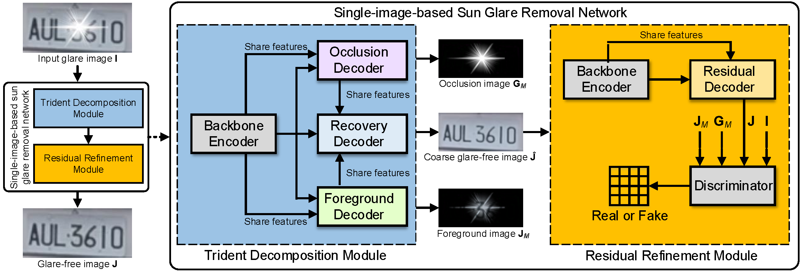
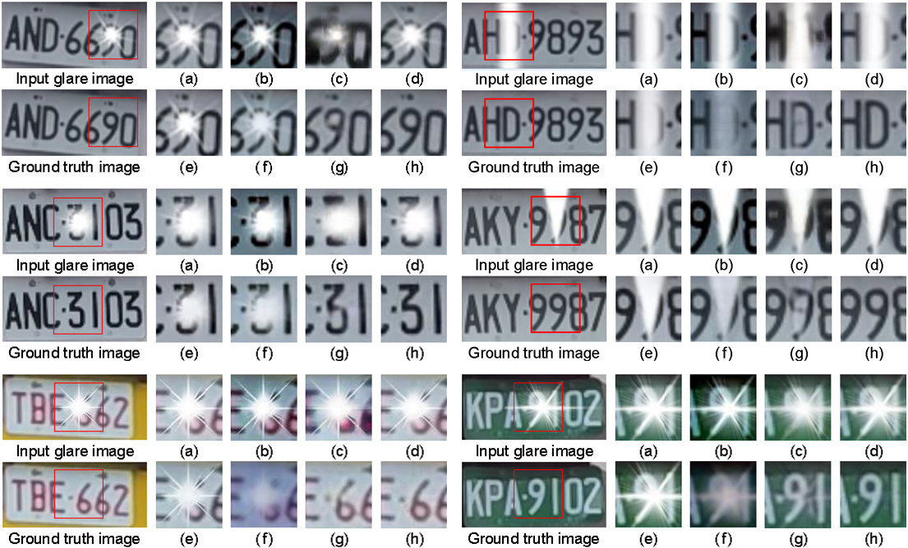

[](https://creativecommons.org/licenses/by-nc-sa/4.0/)
[](https://hits.seeyoufarm.com)


# Deep Trident Decomposition Network for Single License Plate Image Glare Removal

## Introduction
We propose a deep trident decomposition network with a large-scale sun glare image dataset for glare removal from single images. Specifically, the proposed network is designed and implemented with a trident decomposition module for decomposing an input glare image into occlusion, foreground, and coarse glare-free images by exploring background features from spatial locations. Moreover, a residual refinement module is adopted to refine the coarse glare-free image into fine glare-free image by learning the residuals from features of multiscale receptive field.

**Authors**: Bo-Hao Chen, Shiting Ye, Jia-Li Yin, Hsiang-Yin Cheng, and Dewang Chen

**Paper**: [PDF](https://ieeexplore.ieee.org/document/9357944)



## Requirements

### Dependencies
* cuda 10.0_0
* cudnn 7.3.1
* Python 3.5
* numpy 1.15.0
* openCV 4.3.0.38
* keras 2.3.1
* tensorflow 1.14.0
* scikit-image 0.14.2
* pillow 6.2.1
* sewar 0.4.3
* segmentation-models 0.2.1

### Dataset
The sun glare image dataset can be downloaded from [here](https://bigmms.github.io/chen_tits21_dataset/).

### Model
Pre-trained models can be downloaded from [google drive](https://drive.google.com/file/d/1rYJrxFW3s2qh94vELcxQmlU09GR_c7LM/view) or [baidu drive]( https://pan.baidu.com/s/1VJtkwSqYG9WIjNuvv0PSvQ)(password: qpuf).

### It was tested and runs under the following OSs:
* Windows 10
* Ubuntu 16.04

Might work under others, but didn't get to test any other OSs just yet.

## Getting Started:
### Usage
* Training
```bash
$ python train.py --train_path=/your/trainset/path --vaild_path=/your/valset/path --save_model_dir=/save/model/path --load_pretrain=/pretrain/generator/model/path
```
* Testing
```bash
$ python test.py --test_path=/your/testset/path --load_pretrain=/pretrain/generator/model/path
```

### Demo
To test this code
```bash
$ python test.py --test_path=./dataset/test/synthesized_glare_images --load_pretrain=./save_weight/model.h5
```
The test results will be saved in: `./test_result/`

## Qualitative Results
The remaining images were the recovered results using the methods of (a) Engin et al., (b) Li et al., (c) Qian et al., (d) Yang et al., (e) Wei et al., and (f) Zhang et al. as well as (g) our previous method and (h) the method proposed in this study.



## License + Attribution
The ITS code is licensed under [CC BY-NC-SA 4.0](https://creativecommons.org/licenses/by-nc-sa/4.0/). Commercial usage is not permitted. If you use this code in a scientific publication, please cite the following [paper](https://ieeexplore.ieee.org/document/9357944):
```
@ARTICLE{ChenTITS2021,
  author={B. -H. {Chen} and S. {Ye} and J. -L. {Yin} and H. -Y. {Cheng} and D. {Chen}},
  journal={IEEE Transactions on Intelligent Transportation Systems}, 
  title={Deep Trident Decomposition Network for Single License Plate Image Glare Removal}, 
  year={2021},
  volume={},
  number={},
  pages={1-12},
  doi={10.1109/TITS.2021.3058530}}
```
